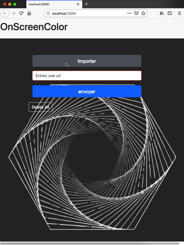

# OnSreenColor

> A javaScript Project build on Android with Cordova

## What this is about

This project uses imagga API to get a list colors of images

### Features

- [x] Have a references colors of images from your disk and from the net

## How to use it

Go to [Github pages]() and experiment with it!
